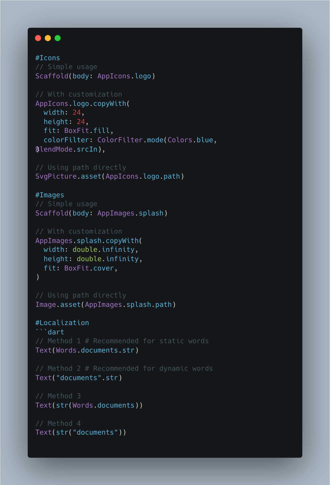

# ResGenerator

[](https://pub.dev/packages/res_generator)

A Flutter code generator for images, icons, and localization with built-in translation support.

**[Read in English](README.md)** | **[O'zbekcha o'qish](README_UZ.md)**



## Features

- ✅ Auto-generate Dart classes from SVG icons and PNG/JPG images
- ✅ Generate and translate localization files automatically
- ✅ Seamless integration with `easy_localization` and similar packages
- ✅ Type-safe resource access
- ✅ Convenient `copyWith` methods for customization

## Installation

Add to your `pubspec.yaml`:
```yaml
dev_dependencies:
  res_generator: ^version
```

## Configuration

Create `res_generator.yaml` in your project root (next to `pubspec.yaml`):
```yaml
words:
  assets_directory: assets/tr/
  class_directory: lib/core/common/words/
  class_file: words.dart
  class_name: Words
  supported_locales: ['uz', 'en', 'ru']  # or ['uz-UZ', 'en-EN', 'ru-RU']
  translated_locales: ['en', 'ru']        # locales to translate
  target_locale: 'uz'                     # source locale

icons:
  assets_directory: assets/icons/
  class_directory: lib/widgets/
  class_file: app_icons.dart
  class_name: AppIcons

images:
  assets_directory: assets/images/
  class_directory: lib/widgets/
  class_file: app_images.dart
  class_name: AppImages
```

## Usage

### Generate Resources
```bash
dart run res_generator:generate
```

### Translate Localization
```bash
dart run res_generator:translate
```

## Code Examples

### Icons
```dart
// Simple usage
Scaffold(body: AppIcons.logo)

// With customization
AppIcons.logo.copyWith(
  width: 24,
  height: 24,
  fit: BoxFit.fill,
  colorFilter: ColorFilter.mode(Colors.blue, BlendMode.srcIn),
)

// Using path directly
SvgPicture.asset(AppIcons.logo.path)
```

### Images
```dart
// Simple usage
Scaffold(body: AppImages.splash)

// With customization
AppImages.splash.copyWith(
  width: double.infinity,
  height: double.infinity,
  fit: BoxFit.cover,
)

// Using path directly
Image.asset(AppImages.splash.path)
```

### Localization
```dart
// Method 1 # Recommended for static words
Text(Words.documents.str)

// Method 2 # Recommended for dynamic words
Text("documents".str)

// Method 3
Text(str(Words.documents))

// Method 4
Text(str("documents"))
```

## Generated Files

The generator creates two types of files:

- `*.dart` - Safe to modify for customization
- `*.res.dart` - Auto-generated, do not modify (will be overwritten)